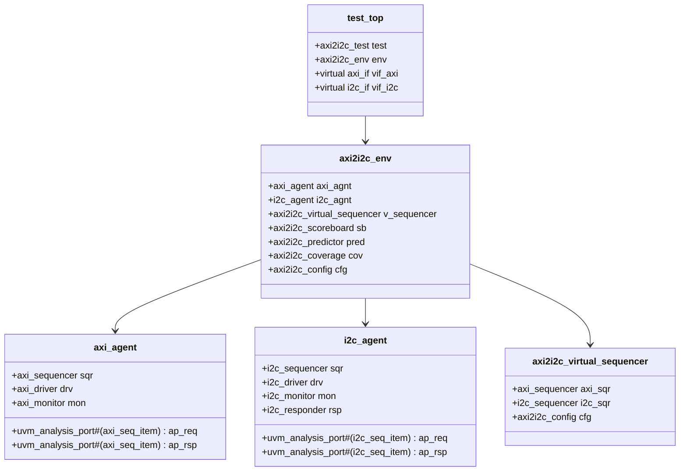

# AXI to I2C Master Bridge UVM Testbench Implementation Plan
### Version 1.0

## Table of Contents
1. [Introduction](#1-introduction)
2. [Overview](#2-overview)
3. [Testbench Architecture](#3-testbench-architecture)
4. [Implementation Roadmap](#4-implementation-roadmap)
5. [File Details](#5-file-details)
6. [Configuration Details](#6-configuration-details)
7. [Coverage Plan](#7-coverage-plan)
8. [Test Scenarios](#8-test-scenarios)
9. [Appendix](#9-appendix)

## 1. Introduction
### 1.1 Purpose
This document outlines the complete implementation plan for developing a UVM testbench for an AXI to I2C Master Bridge. The testbench will verify both read and write operations, protocol conversions, and error scenarios.

### 1.2 Scope
- AXI slave interface verification
- I2C master interface verification
- Protocol conversion verification
- Error injection and recovery
- Performance metrics collection

### 1.3 DUT Overview
The DUT converts AXI bus transactions into I2C master operations:
- AXI write → I2C write
- AXI read → I2C read
- Address mapping
- Status reporting
- Error handling

## 2. Overview

### 2.1 Key Features to Verify
1. Protocol Conversion
   - AXI write to I2C write
   - AXI read to I2C read
   - Address mapping
   - Data integrity
   
2. Error Handling
   - I2C NACK responses
   - Timeout scenarios
   - Invalid addresses
   - Bus arbitration loss
   
3. Performance
   - Latency measurements
   - Throughput analysis
   - Back-to-back transactions
   
4. Corner Cases
   - Clock domain crossing
   - Reset scenarios
   - Interrupt handling
   - Bus busy conditions

## 3. Testbench Architecture



## 4. Implementation Roadmap

### Phase 1: Base Infrastructure
1. Project Setup
   ```
   └── tb
       ├── include
       │   └── axi2i2c_pkg.sv
       ├── interfaces
       │   ├── axi_interface.sv
       │   └── i2c_interface.sv
       └── env
           └── axi2i2c_config.sv
   ```

### Phase 2: Transaction Level
1. AXI Transactions
   ```
   └── tb
       └── seq_items
           ├── axi_seq_item.sv
           └── i2c_seq_item.sv
   ```

### Phase 3: Agent Components
1. AXI Agent
   ```
   └── tb
       └── agents
           ├── axi
           │   ├── axi_agent.sv
           │   ├── axi_driver.sv
           │   ├── axi_monitor.sv
           │   └── axi_sequencer.sv
           └── i2c
               ├── i2c_agent.sv
               ├── i2c_driver.sv
               ├── i2c_monitor.sv
               ├── i2c_sequencer.sv
               └── i2c_responder.sv
   ```

### Phase 4: Sequences
1. Basic Sequences
   ```
   └── tb
       └── sequences
           ├── axi_sequences
           │   ├── axi_base_sequence.sv
           │   ├── axi_write_sequence.sv
           │   └── axi_read_sequence.sv
           ├── i2c_sequences
           │   ├── i2c_base_sequence.sv
           │   └── i2c_response_sequence.sv
           └── virtual_sequences
               ├── axi2i2c_virtual_sequence.sv
               └── axi2i2c_test_sequences.sv
   ```

### Phase 5: Environment Components
1. Scoreboard and Coverage
   ```
   └── tb
       └── env
           ├── axi2i2c_predictor.sv
           ├── axi2i2c_scoreboard.sv
           └── axi2i2c_coverage.sv
   ```

### Phase 6: Environment Integration
1. Environment Setup
   ```
   └── tb
       └── env
           ├── axi2i2c_env.sv
           └── axi2i2c_env_pkg.sv
   ```

### Phase 7: Test Development
1. Test Classes
   ```
   └── tb
       └── tests
           ├── axi2i2c_base_test.sv
           ├── axi2i2c_smoke_test.sv
           ├── axi2i2c_sanity_test.sv
           └── axi2i2c_regression_test.sv
   ```

## 5. File Details

### 5.1 Interface Files
#### axi_interface.sv
```systemverilog
interface axi_interface(input clk, rstn);
    // AXI Write Address Channel
    logic [31:0] awaddr;
    logic [2:0]  awprot;
    logic        awvalid;
    logic        awready;
    
    // AXI Write Data Channel
    logic [31:0] wdata;
    logic [3:0]  wstrb;
    logic        wvalid;
    logic        wready;
    
    // AXI Write Response Channel
    logic [1:0]  bresp;
    logic        bvalid;
    logic        bready;
    
    // AXI Read Address Channel
    logic [31:0] araddr;
    logic [2:0]  arprot;
    logic        arvalid;
    logic        arready;
    
    // AXI Read Data Channel
    logic [31:0] rdata;
    logic [1:0]  rresp;
    logic        rvalid;
    logic        rready;
    
    // Clocking blocks for driver and monitor
    clocking driver_cb @(posedge clk);
        // Driver clocking block details
    endclocking
    
    clocking monitor_cb @(posedge clk);
        // Monitor clocking block details
    endclocking
    
    // Modport definitions
    modport driver(clocking driver_cb);
    modport monitor(clocking monitor_cb);
endinterface
```

#### i2c_interface.sv
```systemverilog
interface i2c_interface(input clk, rstn);
    logic scl;
    logic sda;
    logic [7:0] addr;
    logic [7:0] data;
    logic start;
    logic stop;
    logic ack;
    
    clocking driver_cb @(posedge clk);
        // Driver clocking block details
    endclocking
    
    clocking monitor_cb @(posedge clk);
        // Monitor clocking block details
    endclocking
    
    modport driver(clocking driver_cb);
    modport monitor(clocking monitor_cb);
endinterface
```

## 6. Configuration Details

### 6.1 Configuration Class
```systemverilog
class axi2i2c_config extends uvm_object;
    // AXI Configuration
    rand bit [31:0] axi_base_addr;
    rand bit [7:0]  i2c_slave_addr;
    rand bit [3:0]  max_outstanding;
    
    // I2C Configuration
    rand bit [31:0] i2c_clock_period;
    rand bit [7:0]  i2c_timeout;
    
    // Constraints
    constraint valid_addr_c {
        axi_base_addr[1:0] == 2'b00;
        i2c_slave_addr[0] == 1'b0;
    }
    
    // Coverage
    covergroup config_cg;
        // Coverage points
    endgroup
    
    `uvm_object_utils(axi2i2c_config)
endclass
```

## 7. Coverage Plan

### 7.1 Functional Coverage
1. AXI Transaction Coverage
   - Address ranges
   - Burst types
   - Transaction types
   - Outstanding transactions

2. I2C Protocol Coverage
   - Slave addresses
   - Read/Write operations
   - Clock stretching
   - ACK/NACK responses

3. Cross Coverage
   - AXI write to I2C write
   - AXI read to I2C read
   - Error scenarios
   - Timing scenarios

### 7.2 Code Coverage
1. Line Coverage
2. Branch Coverage
3. Toggle Coverage
4. FSM Coverage
5. Expression Coverage

## 8. Test Scenarios

### 8.1 Basic Tests
1. Smoke Test
   - Simple write operation
   - Simple read operation
   - Reset during idle

2. Sanity Test
   - Multiple writes
   - Multiple reads
   - Mixed read/write

### 8.2 Advanced Tests
1. Protocol Tests
   - Back-to-back transactions
   - Address boundary tests
   - Burst operations
   - Outstanding transaction limits

2. Error Tests
   - I2C NACK response
   - Timeout scenarios
   - Invalid addresses
   - Reset during operation

### 8.3 Virtual Sequences
```systemverilog
class read_after_write_vseq extends axi2i2c_virtual_sequence;
    `uvm_object_utils(read_after_write_vseq)
    
    task body();
        axi_write_seq write_seq;
        axi_read_seq  read_seq;
        i2c_resp_seq  resp_seq;
        
        // Write operation
        `uvm_do_on_with(write_seq, axi_sqr, {
            addr == cfg.axi_base_addr;
            data == 32'h12345678;
        })
        
        // Wait for I2C operation
        wait_i2c_idle();
        
        // Read operation
        `uvm_do_on_with(read_seq, axi_sqr, {
            addr == cfg.axi_base_addr;
        })
        
        // Control I2C response
        `uvm_do_on_with(resp_seq, i2c_sqr, {
            data == 32'h12345678;
        })
    endtask
endclass
```

## 9. Appendix

### 9.1 Directory Structure
```
project/
├── rtl/
│   └── axi2i2c_bridge.sv
├── tb/
│   ├── include/
│   │   └── axi2i2c_pkg.sv
│   ├── interfaces/
│   │   ├── axi_interface.sv
│   │   └── i2c_interface.sv
│   ├── agents/
│   ├── sequences/
│   ├── env/
│   └── tests/
├── sim/
│   ├── scripts/
│   └── waves/
└── docs/
    └── test_plan.pdf
```

### 9.2 Compilation Order
1. Interface files
2. Package files
3. Base classes
4. Agent components
5. Environment components
6. Test classes
7. Top-level files

### 9.3 Regression Suite
```tcl
# Example regression script
run_test smoke_test
run_test sanity_test
run_test protocol_test
run_test error_test
run_test stress_test
```
